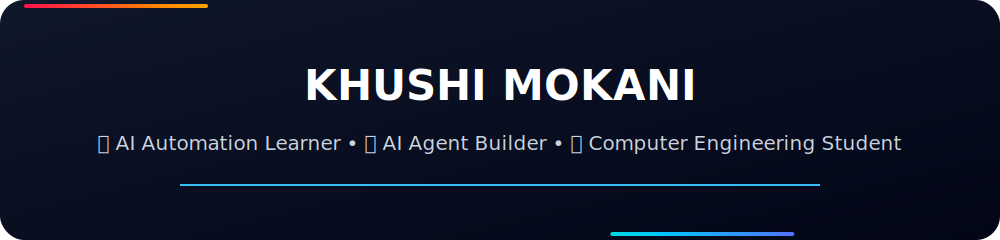

  

# Hi there 👋 I'm Khushi Mokani
<h1 align="center">Hi 👋, I'm Khushi Mokani</h1>

<h3 align="center">
Computer Engineering Student • AI Automation Learner • Full Stack Learner
</h3>

---

## 🚀 About Me

- 🎓 Computer Engineering Student
- 🤖 Building AI Agents & Business Automations
- 💻 Learning Full Stack Development & LLMOps
- 🏆 Passionate about Hackathons & Open Source
- 🌱 Currently learning LangGraph, FastAPI, n8n and React

---

## 🛠 Tech Stack

### Languages
- Python
- Java
- JavaScript
- C

### Frameworks
- React
- Node.js
- FastAPI

### AI
- OpenAI
- LangChain
- LangGraph
- n8n
- Azure AI

### Tools
- Git
- GitHub
- VS Code
- Docker

### AI Agents
- AutoGen
- CrewAI
- LangGraph
- Google ADK
- Microsoft Agent Framework
  
---

## 🚀 Featured Projects

⭐ AI Customer Support Agent

⭐ AI Email Assistant

⭐ TaxShield AI

⭐ Banking System Prototype

⭐ Stock Price Analysis

⭐ Portfolio Website

---

## 📈 Current Goals

- Build production-ready AI Agents
- Contribute to Open Source
- Reach 500+ LeetCode Problems
- Launch an AI Automation Agency

---

## 📫 Connect With Me

- LinkedIn: https://www.linkedin.com/in/khushi-mokani-330b98351?utm_source=share_via&utm_content=profile&utm_medium=member_android

- Email: khushimokani1207@gmail.com 

⭐ *"Building AI solutions that solve real-world problems."*
